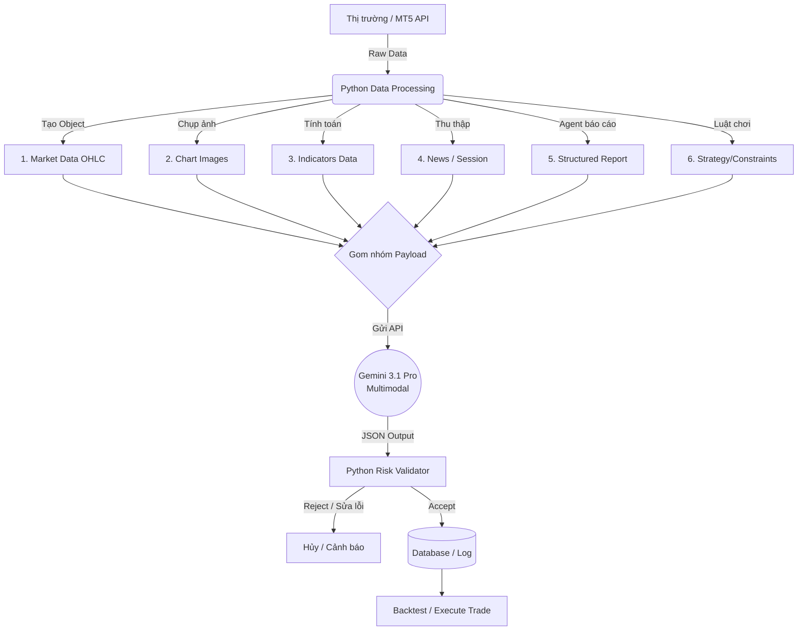

# 🤖 KIẾN TRÚC HỆ THỐNG AI TRADING PIPELINE
**Cốt lõi:** Kết hợp Python (Xử lý Data, Toán học, Validation) và Gemini Multimodal (Suy luận, Nhận diện Pattern).

---

## 1. LUỒNG XỬ LÝ TỔNG QUAN (WORKFLOW)



---

## 2. KIẾN TRÚC INPUT (6 NHÓM DỮ LIỆU)

Nguyên tắc: **Chart để AI "nhìn" pattern, Raw data để AI "đo" thông số.**

### Nhóm 1: Market Data (Dữ liệu giá)
Bắt buộc phải có giá hiện tại và OHLC các khung thời gian liên quan để tránh việc AI đọc nhầm pixel trên ảnh.
```json
{
  "symbol": "EURUSD",
  "timestamp": "2026-09-17T15:30:00+00:00",
  "bid": 1.17452, "ask": 1.17460, "spread": 0.8,
  "timeframes": {
    "M15": [{"time": "...", "open": 1.1738, "high": 1.1748, "low": 1.1734, "close": 1.1745, "volume": 1234}]
  }
}
```

### Nhóm 2: Chart Images (Tầm nhìn của AI)
Gửi bộ ảnh đa khung thời gian theo thứ tự từ lớn đến nhỏ (vd: `01_D1.png`, `02_H4.png`, `03_H1.png`, `04_M15.png`, `05_M5.png`).
Trên chart cần hiển thị rõ: Candlestick, vùng S/R, Liquidity, FVG, EMA (tùy chiến lược).

### Nhóm 3: TradingAgent Report (Báo cáo cấu trúc)
Dữ liệu đã được tiền xử lý bởi thuật toán để cung cấp ngữ cảnh nhanh cho LLM.
```json
{
  "market_structure": {"D1": "bullish", "H1": "bullish", "M15": "bullish"},
  "key_levels": {"support": [1.1720, 1.1735], "resistance": [1.1760, 1.1780]},
  "liquidity": {"buy_side": [1.1760], "sell_side": [1.1720]},
  "fvg": [{"timeframe": "M15", "zone": [1.1738, 1.1742]}]
}
```

### Nhóm 4: Technical Indicators (Chỉ báo số học)
Tuyệt đối không để AI tự đọc RSI/MACD từ ảnh, hãy cấp giá trị số.
```json
{
  "H1": {"ema20": 1.1732, "ema50": 1.1718, "rsi14": 61.4, "atr14": 0.00115}
}
```

### Nhóm 5: Fundamental & Context (Vĩ mô & Thời gian)
Cực kỳ quan trọng để né Whipsaw do tin tức.
```json
{
  "session": "London",
  "day_of_week": "Thursday",
  "economic_events": [
    {"currency": "USD", "event": "FOMC", "time": "18:00", "importance": "high"}
  ]
}
```

### Nhóm 6: Trading Constraints & Strategy (Luật chơi)
Định nghĩa rõ giới hạn rủi ro và điều kiện Setup hợp lệ.
```json
{
  "constraints": {"minimum_rr": 2.0, "allow_news_trade": false},
  "strategy": {
    "name": "MTF Liquidity Sweep",
    "entry_conditions": ["H1 trend aligned", "M15 liquidity sweep", "M5 confirmation"]
  }
}
```

---

## 3. KIẾN TRÚC OUTPUT CHUẨN HÓA (JSON SCHEMA)

Bắt buộc ép LLM trả về đúng định dạng JSON này.
*Lưu ý:* Đưa `thought_process` lên đầu để kích hoạt Chain-of-Thought (chuỗi suy luận logic), giúp AI ra quyết định chính xác hơn ở các trường bên dưới. **"decision": "WAIT"** là một output hoàn toàn hợp lệ và cần được khuyến khích.

```json
{
  "thought_process": {
    "market_context": "Đánh giá cấu trúc H4 và H1...",
    "setup_evaluation": "Kiểm tra M15 có quét thanh khoản chưa...",
    "risk_assessment": "Tin tức ảnh hưởng và tỷ lệ R:R hiện tại..."
  },
  
  "decision": "WAIT",  // Hoặc "BUY", "SELL"
  
  "symbol": "EURUSD",
  "bias": "bullish",
  "setup": "liquidity_sweep",
  
  "entry": {
    "type": "limit",
    "zone_low": 1.1738,
    "zone_high": 1.1742
  },
  
  "stop_loss": 1.1729,
  "take_profit": [1.1760, 1.1780],
  
  "risk_reward": 2.4,
  "confidence": 0.74,
  
  "invalidation": "M15 đóng nến dưới vùng 1.1729",
  "risks": ["Sắp có tin FOMC", "Spread có thể giãn"]
}
```

---

## 4. NGUYÊN TẮC THIẾT KẾ (DESIGN PRINCIPLES)

1. **AI không làm toán:** Việc tính số Pips, tính Lot Size, tính % Risk, hay check lỗi Spread đều phải do Code Python phía sau đảm nhận. AI chỉ phụ trách Tìm kiếm Setup (Reasoning) và cho mức giá (Price Levels).
2. **Interleaving Prompt:** Khi gửi API, hãy xen kẽ ảnh và text (Vd: Khúc text thông số D1 -> Ảnh chart D1 -> Text thông số H4 -> Ảnh chart H4...) để AI nhận diện không gian thời gian tốt nhất.
3. **Structured Validation:** Sử dụng Pydantic (Python) kết hợp Gemini Structured Outputs để 100% dữ liệu trả về là JSON hợp lệ, sẵn sàng ghi thẳng vào Database phục vụ Backtest.
